## Part 1. Установка ОС

* С официального сайта скачан образ Ubuntu 20.04.2 Server LTS без графического интерфейса.
* С помощью VirtualBox, ОС была установлена на виртуальную машину.
* Проверка версии установленной ОС: \
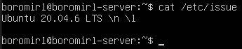

## Part 2. Создание пользователя

* Создание нового пользователя `new-user`: \
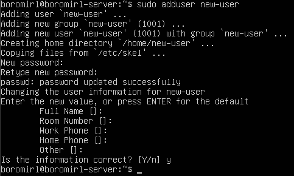
* Добавление нового пользователя в группу `adm`: \
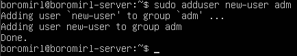
* Вывод комманды `cat /etc/passwd` (`new-user` - последняя строка): \
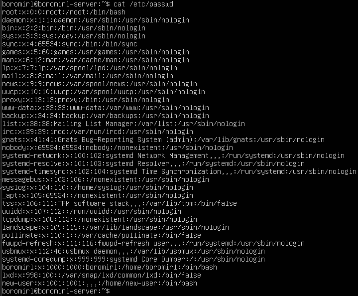

## Part 3. Настройка сети ОС

* Изменение имени компьютера на `user-1`: \
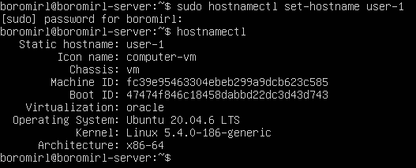
---
* Изменение временной зоны на `Новосибирск`: \
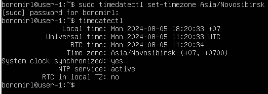
---
* Список сетевых интерфейсов: \
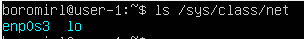
- >Интерфейс lo (loopback, локальная петля) - специальный сетевой интерфейс, который присутствует на любом компьютере и сервере. Он используется для отладки сетевых программ и запуска серверных приложений на локальной машине.
---
* IP адрес устройства: \
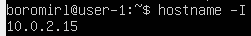
- >DHCP расшифровывается как Dynamic Host Configuration Protocol — протокол динамической настройки узла. DHCP — протокол прикладного уровня модели TCP/IP, служит для назначения IP-адреса клиенту.
---
* Внешний ip адрес шлюза: \
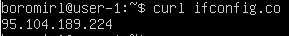
* Внутренний ip адрес шлюза: \
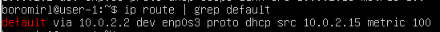
---
* Изменим файл конфигурации сети (`/etc/netplan/00-installer-config.yaml`): \
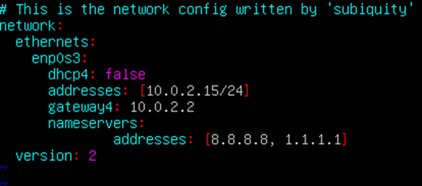
* Применим изменения, использовав команду:
    ```
    sudo netplan apply
    ```
* Проверка после перезагрузки: \
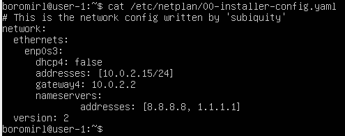
* Пропингуем `1.1.1.1`, `8.8.8.8` и `ya.ru`: \


## Part 4. Обновление ОС

* Для обновления списка пакетов воспользуемся командой:
    ```
    sudo apt update
    ```
    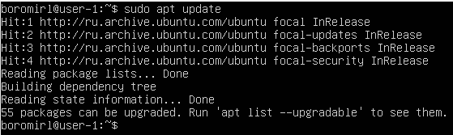

* Обновим пакеты до последней версии командой:
    ```
    sudo apt full-upgrade
    ```
* После этого проверим наличие обновлений (отсутствуют): \
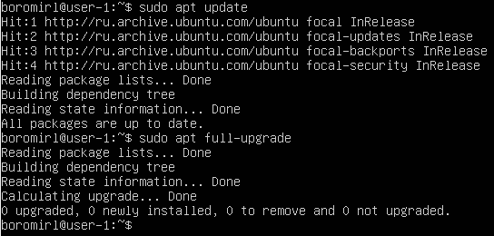

## Part 5. Использование команды sudo

* Разрешим новому пользователю выполнять команды `sudo`, добавив его в группу sudo командой:
    ```
    sudo usermod -aG sudo new-user
    ```
* Затем проверим добавление `new-user` в группу командой:
    ```
    groups new-user
    ```
    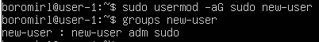
- > Sudo (substitute user and do, т.е. подменить пользователя и выполнить) - это утилита для операционных систем семейства Linux, позволяющая пользователю запускать программы с привилегиями другой учётной записи, как правило, суперпользователя. Подразумевается, что мы подменяем пользователя на root, давая ему право на выполнение задач.
* Перейдем на нового пользователя: \
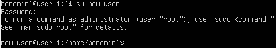
* Изменим `hostname` от имени нового пользователя: \
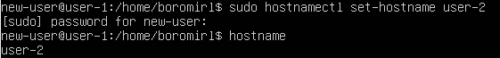
* Перезагрузим сервер и проверим `hostname`: \
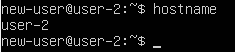

## Part 6. Установка и настройка службы времени

* Используем команду:
    ```
    timedatectl show
    ```
    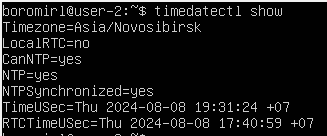
- > На скриншоте видно, что служба NTP активна и время синхронизируется.

## Part 7. Установка и использование текстовых редакторов

### VIM

* Содержимое файла `test_vim.txt` перед закрытием с сохранением: \
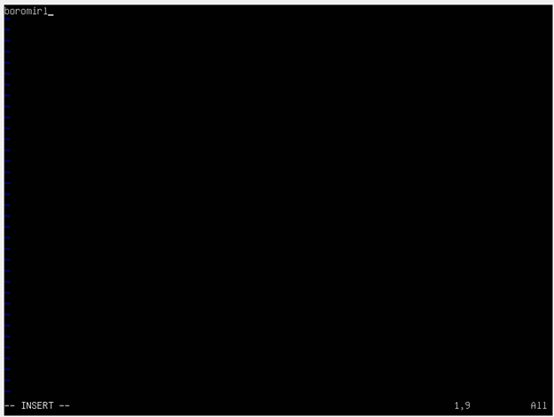
    * Для выхода с сохранением необходимо перейти в командный режим, нажав Esc, а затем ввести `:wq`.
* Содержимое файла `test_vim.txt` перед закрытием без сохранения: \

    * Для выхода без сохранения необходимо перейти в командный режим, нажав Esc, а затем ввести `:q!`.
* Проверим, что изменения не сохранились: \
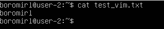
* Результат поиска в `VIM`: \
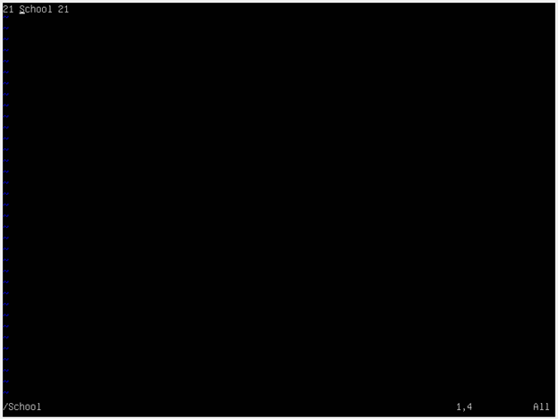
* Замена слова: \
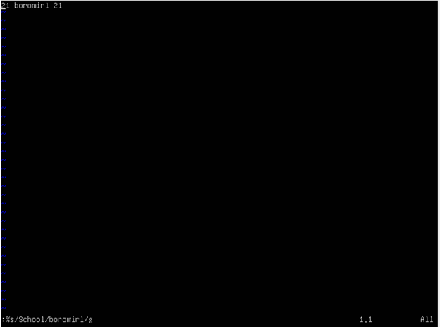

---

### NANO

* Содержимое файла `test_nano.txt` перед закрытием с сохранением: \
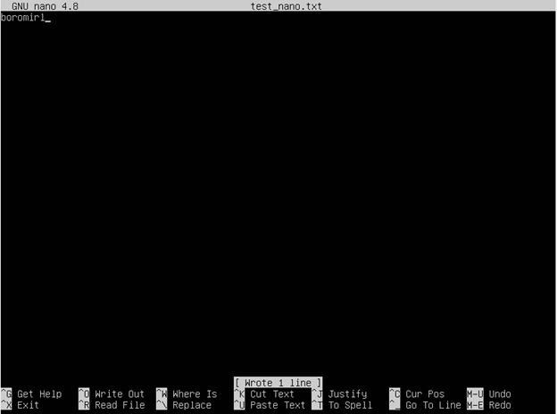
    * Для выхода с сохранением необходимо нажать сначала `ctrl + O` для сохранения изменений, а затем `ctrl + X` для выхода.
* Содержимое файла `test_nano.txt` перед закрытием без сохранения: \
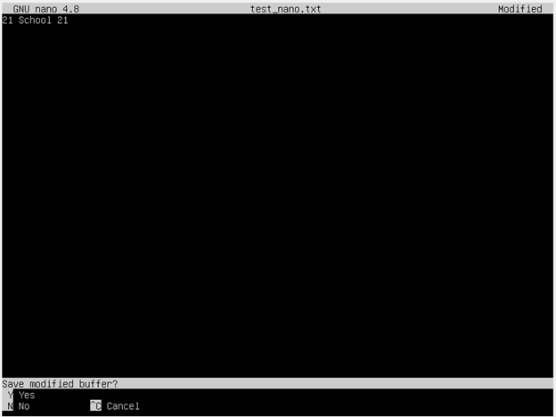
    * Для выхода без сохранения необходимо нажать `ctrl + X`, а затем `N` для отказа от сохранения изменений.
* Проверим, что изменения не сохранились: \
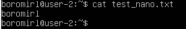
* Поиск слова: \
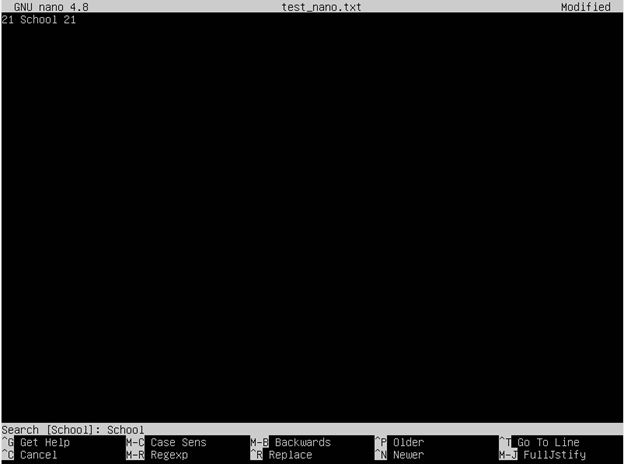
* Процесс замены слова: \
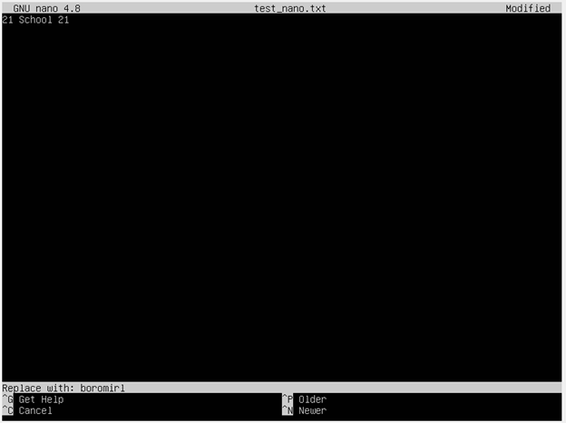
* Результат замены слова: \


---

### JOE

* Установим редактор `JOE` командой:
    ```
    sudo apt install joe
    ```
* Содержимое файла `test_joe.txt` перед закрытием с сохранением: \
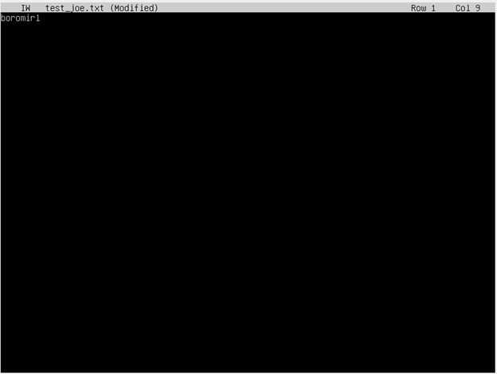
    * Для выхода с сохранением необходимо нажать сначала `ctrl + K`, а затем `X`.
* Содержимое файла `test_joe.txt` перед закрытием без сохранения: \
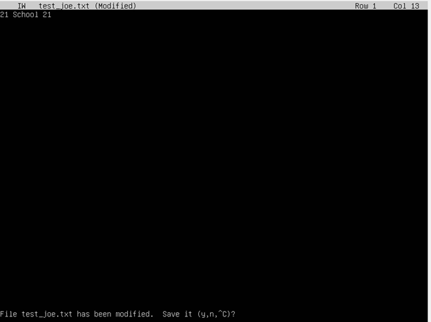
    * Для выхода без сохранения необходимо нажать `ctrl + K`, а затем `Q` для выхода и `N` для отказа от сохранения изменений.
* Проверим, что изменения не сохранились: \
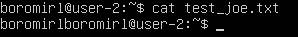
* Поиск слова: \
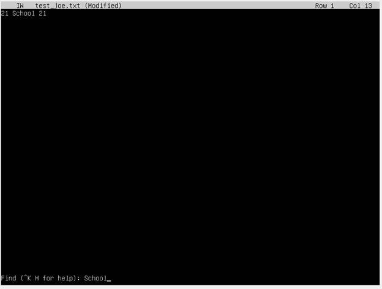
* Процесс замены слова: \

* Результат замены слова: \
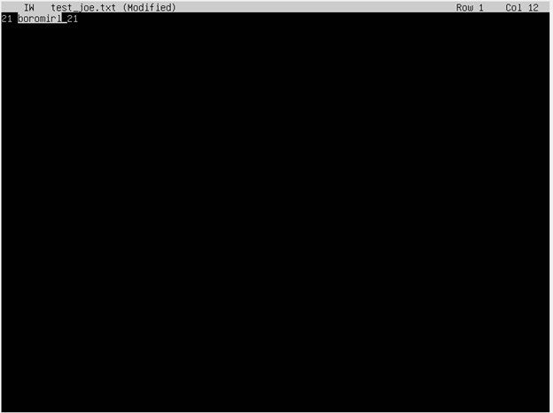


## Part 8. Установка и базовая настройка сервиса SSHD

* Установим службу `SSHd` командой:
    ```
    sudo apt install openssh-server
    ```
* Проверим состояние службы `SSHd`: \
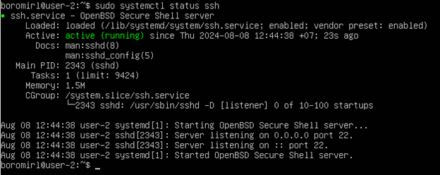
- > На скриншоте видно, что служба активна (active, running) и стартуется автоматически при загрузке системы (loaded).
* Для перенастройки порта откроем конфигурационный файл /etc/ssh/sshd_config и изменим значение Port: \
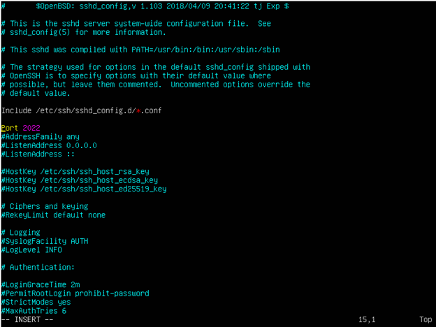
* Перезапустим службу командой:
    ```
    sudo systemctl restart sshd
    ```
* Проверим состояние службы после перезагрузки: \
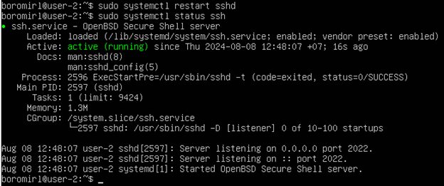
* Используем команду:
    ```
    ps aux | grep sshd
    ```
* Проверим с ее помощью наличие процесса `sshd`: \
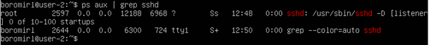
    * `ps` - команда для просмотра процессов.
    * `a` - показать процессы всех пользователей.
    * `u` - ориентированный на пользователя формат, предоставляющий подробную информацию о процессах.
    * `x` - показывать процессы, которые не имеют терминала.
* Используем команду:
    ```
    netstat -tan
    ```
    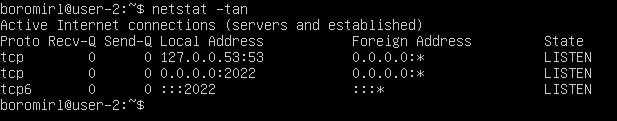
* Ключи netstat:
    * `t` - показать tcp порты.
    * `a` - показать все порты, и закрытые, и открытые.
    * `n` - вывод активных подключений TCP с отображением адресов и номеров портов в числовом формате без попыток определения имен.
* Столбцы netstat -tan:
    * `Proto` – используемый протокол  (в нашем случае tcp).
    * `Recv-Q` – количество байт, которые находятся в очереди на получение, ожидая обработки.
    * `Send-Q` – количество байт, которые находятся в очереди на отправку, ожидая передачи.
    * `Local address` – локальный адрес и порт нашего устройства, используемые в соединении. 0.0.0.0 в `local address` значит, что служба настроена на прослушивание на всех доступных интерфейсах нашего устройства.
    * `Foreign address` – удаленный адрес и порт, к которому установлено соединение. 0.0.0.0 в `foreign address` значит, что сервис находится в состоянии прослушивания и нет установленного соединения.
    * `State` – состояние соединения.


## Part 9. Установка и использование утилит top, htop

* Команда `top`: \
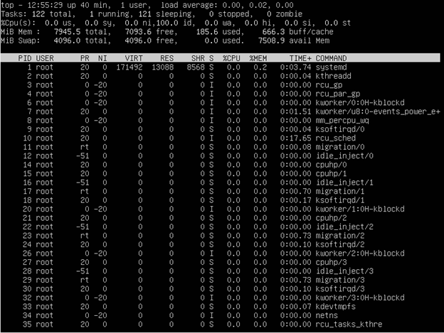
    * uptime - 40 минут.
    * количество пользователей - 1.
    * общая загрузка системы - 0.00, 0.02, 0.00.
    * общее количество процессов - 122.
    * загрузка cpu - 0.0 (id 100.0 значит, что 100% нигде не задействовано).
    * загрузка памяти - 185.6 из 7945.5.
* Отсортируем по используемой памяти, нажав `M`: \
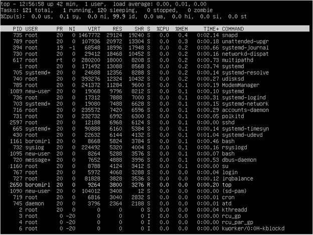
    * Больше всего занимает процесс с PID 735.
* Отсортируем по занимаемому процессорному времени, нажав `P`: \
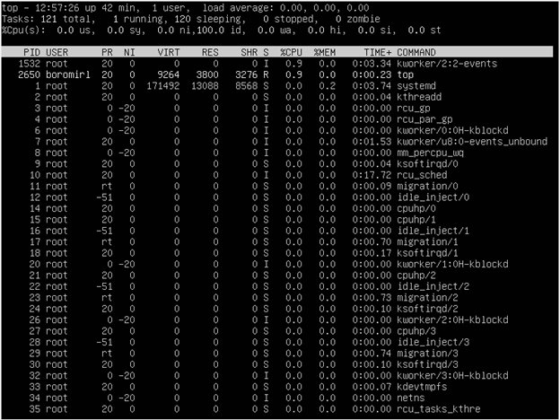
    * Больше всего занимает процесс с PID 1532.
* Команда `htop`.
* Сортировка по `PID`: \

* Сортировка по `PERCENT_CPU`: \
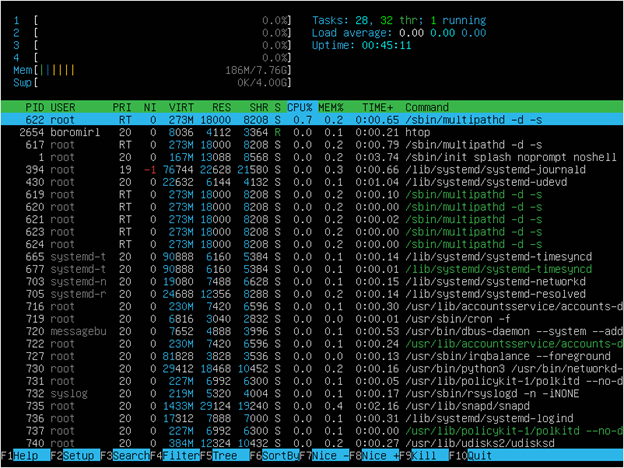
* Сортировка по `PERCENT_MEM`: \
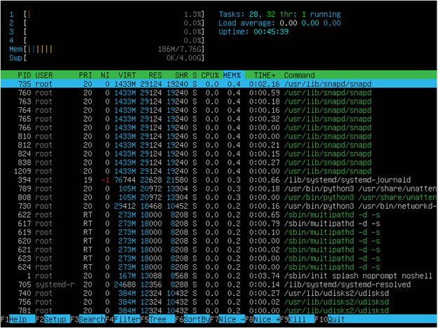
* Сортировка по `TIME`: \
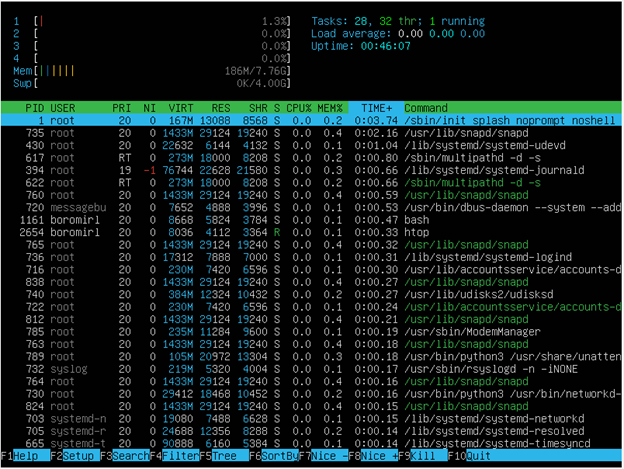
* Фильтрация по `sshd`: \
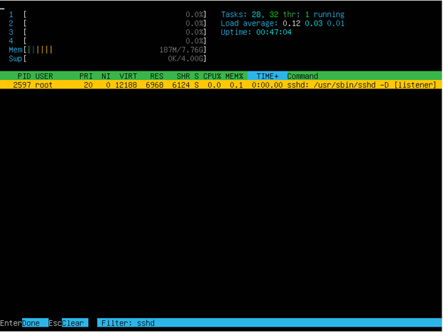
* Поиск `syslog`: \

* Меню добавления вывода: \
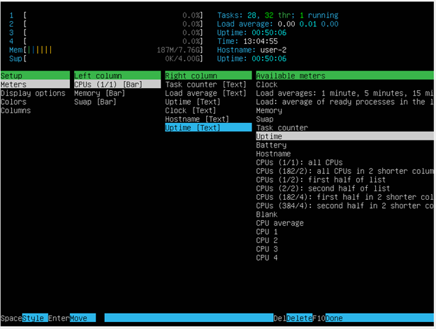
* Результат добавления `hostname`, `clock` и `uptime`: \
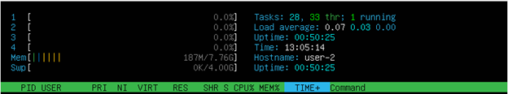

## Part 10. Использование утилиты fdisk

* Выполним команду:
    ```
    fdisk -l
    ```
    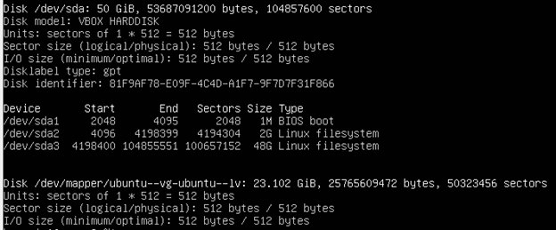
    * Название диска - VBOX HARDDISK (/dev/sda)
    * Размер диска - 50 Гб
    * количество секторов - 104 857 600 
* Узнаем размер swap командой:
    ```
    free -h
    ```
    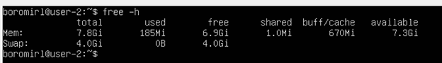
    * swap - 4 Гб

## Part 11. Использование утилиты df

* Выполним команду `df`: \
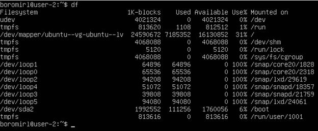
    * Размер раздела ( / ) - 24 590 672
    * Размер занятого пространства - 7 185 352
    * Размер свободного пространства - 16 130 852
    * Процент использования - 31%
    * Единица измерения - Килобайт
* Выполним команду:
    ```
    df -Th
    ```
    
    * Размер раздела ( / ) – 24 Гб
    * Размер занятого пространства – 6.9 Гб
    * Размер свободного пространства – 16 Гб
    * Процент использования – 31%
    * Тип файловой системы – ext4.
- >Ext4 - журналируемая файловая система, используемая в ОС на ядре Linux. Основана на файловой системе Ext3, но отличается тем, что в ней представлен механизм записи файлов в непрерывные участки блоков (екстенты), уменьшающий фрагментацию и повышающий производительность. В ней есть журналирование, то есть в ней предусмотрена запись некоторых данных, позволяющих восстановить файловую систему при сбоях в работе компьютера.

## Part 12. Использование утилиты du

* Использование команды `du`: \
    
* Размер папки `/home` в байтах и в человекочитаемом виде (`-h`): \

* Размер папки `/var` в байтах и в человекочитаемом виде (`-h`): \

* Размер папки `/var/log` в байтах и в человекочитаемом виде (`-h`): \

* Размер содержимого папки `/var/log` в байтах: \


## Part 13. Установка и использование утилиты ncdu

* Установим пакет `ncdu` командой:
    ```
    sudo apt install ncdu
    ```
* Папка `/home`: \

* Папка `/var`: \

* Папка `/var/log`: \


## Part 14. Работа с системными журналами

* Файл `var/log/dmesg`: \

* Файл `var/log/syslog`: \

* Файл `var/log/auth.log` (выделен лог о последней успешной авторизации): \

    * Время - 17:21:53
    * Имя пользователя - boromirl
    * Метод входа в систему - LOGIN(uid=0)
* Перезапустим службу SSHd командой:
    ```
    sudo systemctl restart sshd
    ```
* Сообщение о рестарте SSHd в файле `var/log/auth.log`: \


## Part 15. Использование планировщика заданий CRON

* Для редактирования правил `cron` воспользуемся командой:
    ```
    crontab -e
    ```
* Выберем редактор nano и создадим новое правило, запускающее команду `uptime` через каждые 2 минуты: \

* Проверим работу `cron` с помощью файла `/var/log/syslog`: \

* Выведем на экран список текущих заданий `cron` командой:
    ```
    crontab -l
    ```
    
* Удалим все задания из планировщика командой:
    ```
    crontab -r
    ```
* Проверим список заданий еще раз: \   
