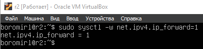
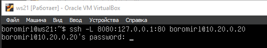

## Part 1. Инструмент ipcalc

### 1.1. Сети и маски

* Поднимем виртуальную машину `ws1`
* Установим утилиту `ipcalc` командой:
    ```
    sudo apt install ipcalc
    ```
* Определим адрес сети 192.167.38.54/13 с помощью `ipcalc`: \

* Адрес сети - 192.160.0.0/13 (Network на скриншоте)
---
* Переведем маску 255.255.255.0 в префиксную и двоичную запись: \

* На скрине строка Netmask. Сначала нормальный вид – 255.255.255.0, потом префикс = 24, потом двоичный 11111111. 11111111. 11111111.00000000
---
* Переведем маску /15 в обычную и двоичную запись: \

* На скрине строка Netmask. Сначала нормальный вид – 255.254.0.0, потом префикс = 15, потом двоичный 11111111.11111110.00000000.00000000
---
* Переведем 11111111.11111111.11111111.11110000 в обычную и префиксную запись: \

* На скрине строка Netmask. Сначала нормальный вид – 255.255.255.240, потом префикс = 28, потом двоичный 11111111.11111111.11111111.11110000
---
*  Минимальный и максимальный хост в сети 12.167.38.4 при маске /8: \

* На скрине: HostMin 12.0.0.1 и HostMax 12.255.255.254
---
*  Минимальный и максимальный хост в сети 12.167.38.4 при маске 11111111.11111111.00000000.00000000: \

* На скрине: HostMin 12.167.0.1 и HostMax 12.167.255.254
---
*  Минимальный и максимальный хост в сети 12.167.38.4 при маске  255.255.254.0: \

* На скрине: HostMin 12.167.38.1 и HostMax 12.167.39.254
---
*  Минимальный и максимальный хост в сети 12.167.38.4 при маске /4: \

* На скрине: HostMin 0.0.0.1 и HostMax 15.255.255.254

### 1.2. localhost

* Для `localhost` зарезервированы адреса 127.0.0.0 – 127.255.255.255
* 194.34.23.100 – не подходит, класс С: \


* 127.0.0.2 – Подходит - loopback: \


* 127.1.0.1 – подходит loopback: \


* 128.0.0.1 – не подходит класс В: \


### 1.3. Диапазоны и сегменты сетей

* Частные адреса находятся в диапазонах:
    * 10.0.0.0 – 10.255.255.255
    * 172.16.0.0 – 172.31.255.255
    * 192.168.0.0 – 192.168.255.255
    * 127.0.0.0 – 127.255.255.255
* Следовательно:
    * 10.0.0.45 – частный
    * 134.43.0.2 – публичный
    * 192.168.4.2 – частный
    * 172.20.250.4 – частный
    * 172.0.2.1 – публичный
    * 192.172.0.1 – публичный
    * 172.68.0.2 – публичный
    * 172.16.255.255 – частный
    * 10.10.10.10 – частный
    * 192.169.168.1 – публичный
* Шлюз может иметь любой адрес внутри сети. Адреса, находящиеся внутри сети 10.10.0.0/18 подходят.
* На скриншоте мы видим, что HostMin – 10.10.0.1 и HostMax – 10.10.63.254 \

* Следовательно:
    * 10.10.0.2, 10.10.10.10, 10.10.1.255 – подходят
    * 10.0.0.1, 10.10.100.1 – вне диапазона

## Part 2. Статическая маршрутизация между двумя машинами

* Поднимем две виртуальные машины `ws1` и `ws2`
* Создадим внутреннюю сеть. Для этого перейдем в настройки виртуальных машин и включим сетевые адаптеры. Используем тип интерфейса `Внутренняя сеть`. Назовем сеть my-network: \

* С помощью команды `ip a` посмотрим существующие сетевые интерфейсы:
* `ws1`: \

* `ws2`: \

* Изменим файл `etc/netplan/00-installer-config.yaml` на обеих машинах: \
* `ws1`: \

* `ws2`: \

* Выполним команду
    ```
    sudo netplan apply
    ```
* на ws1: \

* и на ws2: \


### 2.1. Добавление статического маршрута вручную

* Добавим статический маршрут между машинами на обоих машинах командой `ip r`:
* `ws1`: \

* `ws2`: \


* Пропингуем соединение между машинами:
* `ws1`: \

* `ws2`: \


### 2.2. Добавление статического маршрута с сохранением

* Перезапустим машины
* Добавим статический маршрут от одной машины до другой с помощью файла `/etc/netplan/00-installer-config.yaml`: \
* `ws1`: \

* `ws2`: \


* Пропингуем соединение между машинами:
* `ws1`: \

* `ws2`: \


## Part 3. Утилита iperf3

### 3.1. Скорость соединения

* 8 Mbps = 1 MB/s
* 100 MB/s = 800 000 Kbps
* 1 Gbps = 1000 Mbps

### 3.2. Утилита iperf3

* Измерим скорость соединения между `ws1` и `ws2`
* Используем команду `iperf3` с флагом `–s`(сервер) и `–f M` (Мегабайты) на `ws1`: \


* Используем ту же команду на `ws2`, но заменим `-s` на `-c`(клиент): \

* Ориентируемся на результаты, полученные на клиентской машине
* Скорость соединения – 87.7 Мегабайт в секунду

## Part 4. Сетевой экран

### 4.1. Утилита iptables

* Создадим скрипт с добавлением правил на обеих машинах. На первой машине сначала применим запрещающее правило, а затем разрешающее.
* Файл `/etc/firewall.sh` на `ws1`: \


* На второй машине сначала применим разрешающее правило, а затем запрещающее.
* Файл `/etc/firewall.sh` на `ws2`: \


* Используем команду
    ```
    chmod +x /etc/firewall.sh
    ```
* Для разрешения запуска скрипта и запустим скрипты на обеих машинах командой `/etc/firewall.sh`. Используем `iptables –L` для проверкки установленных правил.
* `ws1`: \

* `ws2`: \

* Объяснение:
    * В iptables порядок правил имеет критическое значение, поскольку они обрабатываются последовательно, сверху вниз. Это означает, что первое совпадение с пакетом определяет это действие - разрешение или запрет.

### 4.2. Утилита nmap

* Пропингуем первую машину со второй: \

* Как мы видим, первая машина не пингуется.
* Используем утилиту `nmap` для проверки первой машины: \

* Здесь мы видим строку: `host is up`. Однако все порты закрыты.

## Part 5. Статическая маршрутизация сети

### 5.1 Конфигурация адресов машин

* Изменим конфигурации машин в файле `/etc/netplan/00-installer-config.yaml`
* `ws11`: \

* `ws21`: \

* `ws22`: \

* `r1`: \

* `r2`: \


* Перезапустим сервис сети командой
    ```
    sudo netplan apply
    ```
* Проверим адреса машин командой `ip -4 a`:
* `ws11`: \

* `ws21`: \

* `ws22`: \

* `r1`: \

* `r2`: \


* Пропингуем `ws22` из `ws21`: \

* Пропингуем `r1` из `ws11`: \


### 5.2. Включение переадресации IP-адресов

* Запустим на роутерах команду:
    ```
    sysctl -w net.ipv4.ip_forward=1
    ```
* `r1`: \

* `r2`: \


* Откроем на роутерах файл `/etc/sysctl.conf` и добавим строку:
    ```
    net.ipv4.ip_forward = 1
    ```
* Теперь форвардинг будет работать после перезагрузки системы.
* `r1`: \

* `r2`: \


### 5.3. Установка маршрута по умолчанию

* Добавим шлюз по умолчанию для рабочих станций. Для этого в конфигурационном файле добавим `default` перед адресом роутера.
* `ws11`: \

* `ws21`: \

* `ws22`: \


* Используем команду ip r, чтобы убедиться, что маршрут добавлен в таблицу маршутизации
* `ws11`: \

* `ws21`: \

* `ws22`: \


* Пропингуем `r2` из `ws11` и проследим за пингами с помощью команды
    ```
    tcpdump –tn –I enp0s8
    ```
* Пинг: \


### 5.4. Добавление статических маршрутов

* Добавим статические маршруты в конфигурационные файлы `r1` и `r2`.
* `r1`: \

* `r2`: \


* Используем команду `ip r` и покажем таблицы маршрутизации на роутерах.
* `r1`: \

* `r2`: \


* Используем команды `ip r list 10.10.0.0/18` и `ip r list 0.0.0.0/0` на `ws11`: \

* Почему для адреса 10.10.0.0/18 был выбран маршрут, отличный от 0.0.0.0/0, хотя он попадает под маршрут по умолчанию?
    * Ответ: при наличии двух и более маршрутов выбирается маршрут с самой длинной маской т.к. он более точный

### 5.5. Построение списка маршрутизаторов

* Выполним на `r1` команду
    ```
    tcpdump -tnv -i enp0s8
    ```
* Используем `tracerout` для получения списка роутеров на маршруте от `ws11` до `ws21`.
* `ws11`: \

* `ws21`: \

* Как происходит построение пути с помощью `traceroute`:
    1. Отправка пакетов с увеличивающимся TTL:  
   Traceroute отправляет пакеты с протоколом ICMP или UDP к целевому хосту. Каждый пакет имеет поле TTL, которое определяет максимальное количество маршрутизаторов (или хопов), через которые может пройти пакет, прежде чем он будет отброшен.
    2. Каждый узел уменьшает TTL:  
   Каждый маршрутизатор, через который проходит пакет, уменьшает значение TTL на 1. Когда TTL достигает 0, маршрутизатор посылает обратно сообщение об ошибке "Time Exceeded" в ваш компьютер. Это сообщение включает информацию о маршрутизаторе, который отбросил пакет.
    3. Отправка пакетов с увеличивающимся TTL:  
   Traceroute начинает отправку пакетов с TTL, равным 1, и постепенно увеличивает это значение на каждом шаге. Таким образом, на первом шаге пакет достигает только первого маршрутизатора, на втором — доходит до второго и так далее. Каждый маршрутизатор отвечает на запрос, посылая обратно сообщение о превышении времени.
    4. Получение маршрута:  
   Ответы от маршрутизаторов (включая их IP-адреса) позволяют traceroute строить карту пути, через который проходят данные. Каждый шаг отображает хоп (маршрутизатор), который перенаправляет пакет на следующий узел.
    5. Завершение трассировки:  
   Когда пакет достигает целевого хоста, он получает ответ без ошибки "Time Exceeded". Это означает, что путь был полностью пройден, и целевой хост достигнут.

### 5.6. Использование протокола ICMP при маршрутизации

* Выполним команду `tcpdump -n -i enp0s8 icmp` на `r1` и пропингуем несуществующий адрес с `ws11` командой `ping -c 1 10.30.0.111`: \


## Part 6. Динамическая настройка IP с помощью DHCP

* Установим пакет `dhcp-server` командой:
    ```
    Sudo apt install isc-dhcp-server
    ```
* Для `r2` настроим в файле `/etc/dhcp/dhcpd.conf` конфигурацию службы DHCP:
1. Укажем адрес маршрутизатора по умолчанию, DNS-сервер и адрес внутренней сети.
* Файл `/etc/dhcp/dhcpd.conf`: \

2. В файле `resolv.conf` пропишем nameserver `8.8.8.8`: \

* Перезагрузим службу DHCP командой
    ```
    systemctl restart isc-dhcp-server
    ```
* Перезагрузка: \

* Машину `ws21` перезагрузим при помощи `reboot`, а после используем команду `ip a`, чтобы увидеть, что она получила адрес: \

* Также пропингуем `ws22` с `ws21`: \


* Укажем MAC-адрес у `ws11`, для этого в `etc/netplan/00-installer-config.yaml` добавим строки:
    ```
    macaddress: 10:10:10:10:10:BA
    dhcp: true
    ```
* Файл: `etc/netplan/00-installer-config.yaml`: \


* Настроим для `r1` dhcp server, но сделаем выдачу адресов с жесткой привязкой к MAC-адресу.
* Файл `/etc/dhcp/dhcpd.conf`: \

* В файле `resolv.conf` пропишем nameserver `8.8.8.8`: \

* Перезагрузим службу DHCP командой `systemctl restart isc-dhcp-server`: \


* Машину `ws11` перезагрузим при помощи `reboot`, а после используем команду `ip a`, чтобы увидеть, что она получила адрес: \

* Обновим адрес для `ws21`.
* Адрес до обновления: \

* Удаление старого и запрос нового: \

* Новый адрес: \

* Использованые опции DHCP:
    * `subnet 10.10.0.0 netmask 255.255.192.0` - описание сети
    * `range 10.10.0.2 10.10.0.50` - диапозон IP адресов
    * `option routers 10.10.0.1` - адрес шлюза маршрутизатора
    * `domain-name-servers 10.10.0.1` - ip адрес dns сервера
    * `host ws11` - описание хоста
    * `hardware ethernet 10:10:10:10:10:BA` - описание mac-адреса хоста
    * `fixed address 10.10.0.5` - описание ip адреса хоста

## Part 7. NAT

* Установим `apache2` на `ws22` и `r1` командой
    ```
    sudo apt install apache2
    ```
* В файле `/etc/apache2/ports.conf` на `ws22` и `r1` изменим строку `Listen 80` на `Listen 0.0.0.0:80`, то есть сделаем сервер `Apache2` общедоступным
* `ws22`: \

* `r1`: \

* Запустим веб-сервер `Apache` командой `service apache2 start` на `ws22` и `r1`
* `ws22`: \

* `r1`: \

* Добавим в фаервол, созданный по аналогии с фаерволом из Части 4, на `r2` следующие правила: \
    1. Удаление правил в таблице filter — `iptables -F`;
    2. Удаление правил в таблице «NAT» — `iptables -F -t nat`;
    3. Отбрасывать все маршрутизируемые пакеты — `iptables --policy FORWARD DROP`
* Запустим файл также, как в Части 4: \

* Проверим соединение между `ws22` и `r1` командой `ping`: \

* Добавим в файл ещё одно правило:
    4. Разрешить маршрутизацию всех пакетов протокола `ICMP`.
* `firewall.sh`: \

* Запустим файл также, как в Части 4: \

* Проверим соединение между `ws22` и `r1` командой `ping`: \

* Добавим в файл ещё два правила: \
    5. Включим `SNAT`, а именно маскирование всех локальных IP из локальной сети, находящейся за `r2` (по обозначениям из Части 5 — сеть `10.20.0.0`). \
    6. Включим `DNAT` на `8080` порт машины `r2` и добавим к веб-серверу `Apache`, запущенному на `ws22`, доступ извне сети.
* `firewall.sh`: \

* Запустим файл также, как в Части 4: \

* Перед тестированием отключим сетевой интерфейс `NAT`.
* Проверим соединение по `TCP` для `SNAT`: для этого с `ws22` подключимся к серверу `Apache` на `r1` командой:
    ```
    telnet 10.100.0.11 80
    ```
* Результат использования команды: \

* Проверим соединение по `TCP` для `DNAT`: для этого с `r1` подключимся к серверу `Apache` на `ws22` командой `telnet` (обратимся по адресу `r2` и порту `8080`): \


## Part 8. Дополнительно. Знакомство с SSH Tunnels

* Запустим на `r2` фаервол с правилами из Части 7: \

* Запустим веб-сервер `Apache` на `ws22` только на `localhost` (то есть в файле `/etc/apache2/ports.conf` изменим строку `Listen 80` на `Listen localhost:80`): \

* Проверка работы сервера: \

* Воспользуемся `Local TCP forwarding` с `ws21` до `ws22`, чтобы получить доступ к веб-серверу на `ws22` с `ws21`: \

* Вход на `ws22`: \

* Для проверки, сработало ли подключение, перейдем во второй терминал (клавишами `Alt + F2`) и выполним команду:
    ```
    telnet 127.0.0.1 8080
    ```
* Результат выполнения команды: \

* Воспользуемся `Remote TCP forwarding` c `ws11` до `ws22`, чтобы получить доступ к веб-серверу на `ws22` с `ws11`: \

* Вход на `ws22`: \

* Для проверки, сработало ли подключение, перейдем во второй терминал (клавишами `Alt + F2`) и выполним команду:
    ```
    telnet 127.0.0.1 8080
    ```
* Результат выполнения команды: \
