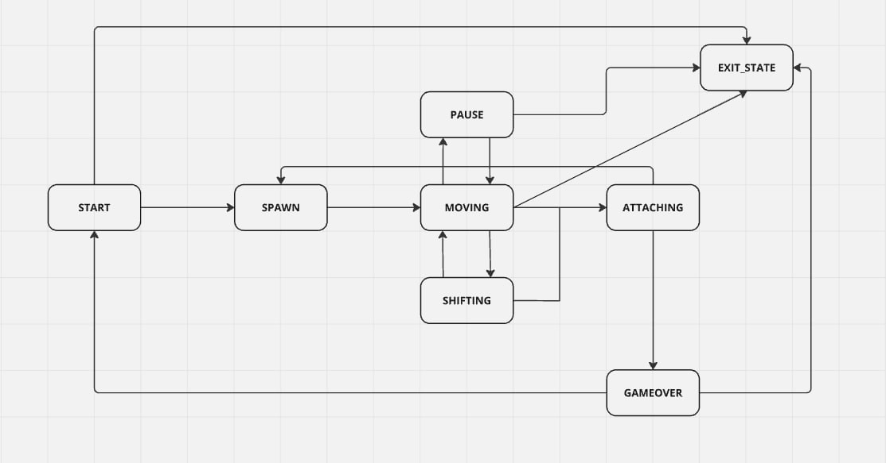
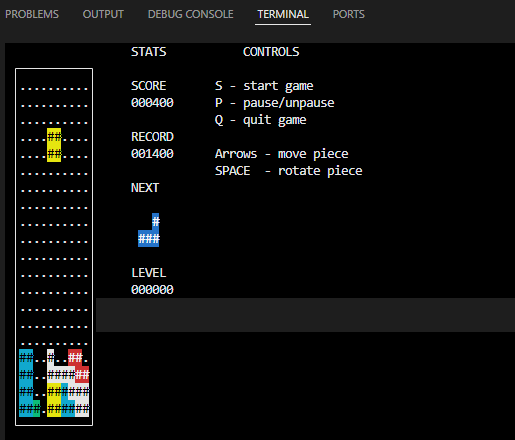
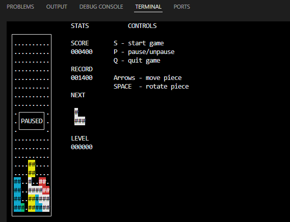
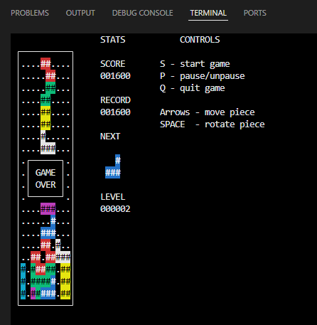

# BrickGame_v1.0-1 (тетрис cli)

## Сборка

* Сборка осуществляется при помощи `Makefile`. Цели:
    * `make` или `make all` или `make install` - "устанавливает" игру. Создается папка `game`, в которой находится статическая библиотека, исполняемый файл и текстовый файл с рекордным значением очков в игре
    * `make test` - тесты библиотеки логики игры (с помощью библиотеки `check`)
    * `make clean` - очистка временных файлов
    * `make gcov_report` - отчет о покрытии тестами (создается папка `report`, отчет можно открыть через `report/index.html`)
    * `make dvi` - автоматическая генерация документации файла (`!! Нужен пакет doxygen`). Создает папку `docs`. Для просмотра - открыть `docs/html/index.html`
    * `make dst` - создать архив `tetris.tar.gz`
* Для запуска игры необходимо собрать игру, перейти в созданную папку `game` и запустить `./tetris`

## Описание

* Проект представляет собой игру `Тетрис` с `cli` итерфейсом
* Проект состоит из двух частей:
    1. Библиотека, реализующая логику работы игры, которую можно подключать к различным GUI
    2. Терминальный интерфейса.
* Логика работы библиотеки реализована при помощи `FSM` (Finite State Machine, Конечный автомат)
* Схема: \

* В игре есть:
    * подсчет очков
    * смена уровней/скорости
    * простейшее сохранение high_score
    * возможность ставить игру на паузу
    * начисление очков в зависимости от количества заполненных линий (1 - 100, 2 - 300, 3 - 700, 4 - 1500)

* Скриншоты из игры: \

---

---

## Автор

* Индивидуальный проект `boromirl`